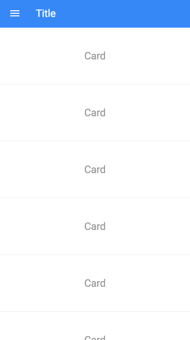

# Material Design: Infinite Scroll



## Install

1) Install dependencies:

```
$ npm install
```

2) Build the files:

```
$ npm build
```

3) Run server:

```
$npm start
```

4) View app at: http://localhost:8080

## Contribute

Set up a watcher to automatically build files on save:

```
$ npm dev
```
